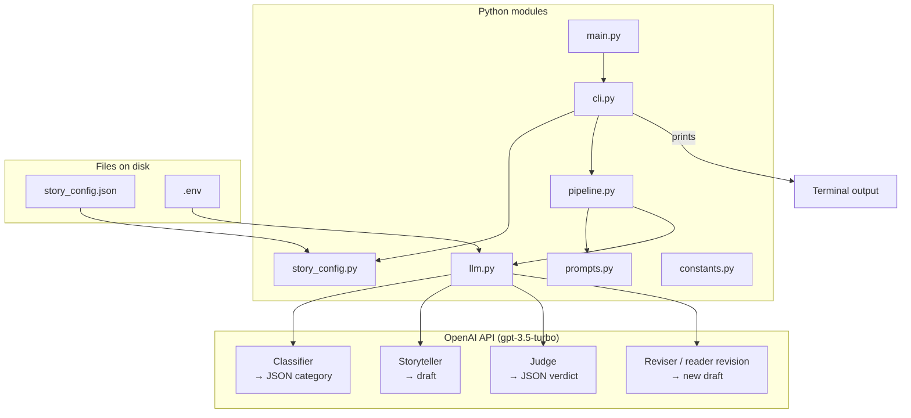
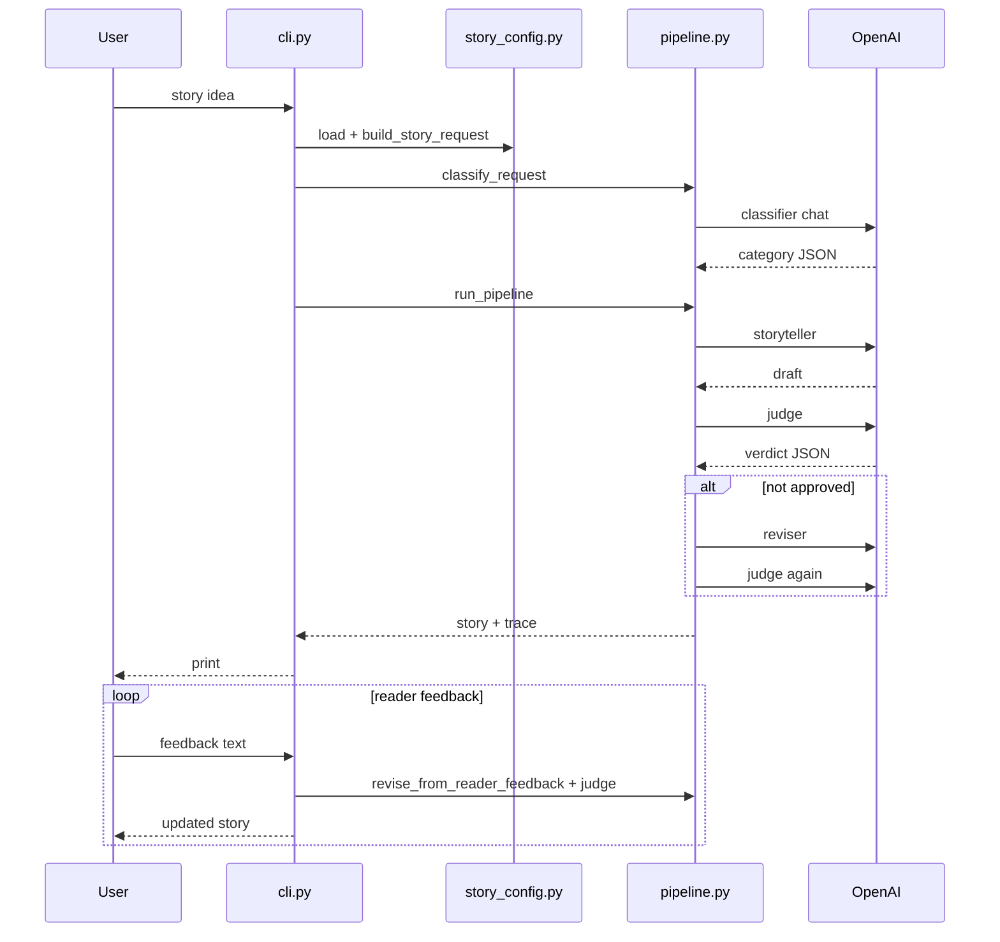

# Architecture: bedtime story + LLM judge

This matches the **current code layout** (split modules + classifier + reader feedback).

## Repo layout (by responsibility)

| File | Responsibility |
|------|----------------|
| **`main.py`** | Assignment-style entry: `call_model()` + simple `main()` (one user prompt → one completion). Loads `.env`. |
| **`cli.py`** | **Full app**: config JSON, classifier, judge + revision, reader feedback. Run: **`python cli.py`**. |
| **`pipeline.py`** | **Classifier** → **draft** → **judge** → optional **reviser** → judge again; plus `revise_from_reader_feedback`. |
| **`prompts.py`** | All **system prompts**, **`CATEGORY_STRATEGIES`**, and **`system_with_strategy()`** (appends category-specific instructions). |
| **`story_config.py`** | Reads **`story_config.json`**, defaults, **`build_story_request()`** (big user message). |
| **`llm.py`** | Lazy **OpenAI client**, **`chat()`**, **`grab_json_dict()`** for judge/classifier JSON. |
| **`constants.py`** | **`MODEL`** (`gpt-3.5-turbo`), paths, **`DEFAULT_CATEGORY`**, feedback round limit, length hints. |

Data files: **`story_config.json`** (settings), **`.env`** (API key, not committed).

---

## Whiteboard-style diagram

```
                         story_config.json
                                |
                                v
         .env (API key)         main.py (simple)    cli.py (full pipeline)
                                |              |
                                |              | story idea
                                |              v
                                |         classify_request  --------+
                                |              |                    |
                                |              | category + strategy |
                                |              v                    |
                                +---------> pipeline.run_pipeline    |
                                               |                    |
                    +--------------------------+                    |
                    |                                               |
                    v                                               v
             OpenAI API (gpt-3.5-turbo)                     prompts.py
                    |                                    (system + category text)
                    |
      +-------------+-------------+-------------+
      |             |             |             |
      v             v             v             v
 Classifier    Storyteller      Judge       Reviser / reader-feedback
 (JSON slug)   (draft story)   (JSON verdict)  (rewrite prose)
      |             |             |             |
      +-------------+-------------+-------------+
                          |
                          v
                    cli prints story + judge summary
                          |
              optional loop: reader text --> revise --> judge --> print
```

---

## Mermaid (GitHub / mermaid.live)



---

## Request flow (step by step)

1. **`cli.main()`** loads **`story_config.py` → `load_story_config()`**.
2. User enters **story idea** (only prompt); optional default from JSON.
3. **`build_story_request()`** merges config + idea into one **user message** string.
4. **`classify_request()`** (LLM) returns a **category slug** + short reason; **`prompts.system_with_strategy()`** adds tailored paragraphs to storyteller / reviser calls.
5. **`run_pipeline()`**: **draft** → **judge**; if not approved, **reviser** → **judge** again; pick best-scoring draft.
6. **CLI** prints judge summary + final story.
7. **Reader feedback loop** (up to **N** rounds in **`constants.py`**): user text → **`revise_from_reader_feedback()`** → **judge** → print.

All model roles use the **same model name** from **`constants.MODEL`** (per README).

---

## Sequence (compact)


